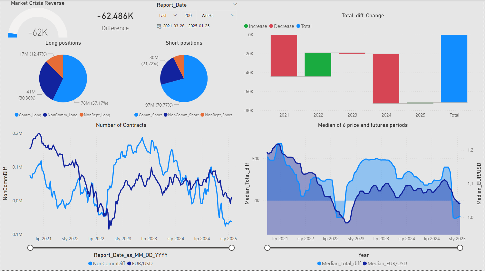

Visualizing Commitment of Traders (COT) Data for EUR/USD
Overview

This project provides a comprehensive dashboard for visualizing Commitment of Traders (COT) data in relation to the EUR/USD exchange rate. The aim is to offer insights into market participants' positioning and its potential influence on the currency pair.

The project utilizes:

    Python: For preprocessing the raw COT and EUR/USD data.
    Power BI: For creating an interactive dashboard with dynamic visualizations.

Data Sources

    Commitment of Traders (COT) Reports:
        Weekly reports from the Chicago Mercantile Exchange (CME).
        Includes data on long and short positions of Commercial, Non-commercial, and Non-reportable traders.

    EUR/USD Exchange Rate:
        Historical exchange rate data synchronized with the COT report dates.

Features
Preprocessing (Python)

    Data cleaning and standardization.
    Calculation of derived metrics, including:
        NonCommDiff: The difference between long and short positions of Non-commercial traders.
        Median_Total_diff: A rolling median of Total_diff (the net difference of positions).
    Merging COT data with EUR/USD prices for unified analysis.

Power BI Dashboard

The dashboard includes the following visualizations:

    Gauge Chart:
        Displays the current net difference between Non-commercial long and short positions.
    Pie Charts:
        Proportional distribution of long and short positions among different market participants.
    Bar Chart:
        Yearly changes in total positions (Total_diff_Change) split by increases and decreases.
    Line Chart (Number of Contracts):
        Historical trend of NonCommDiff alongside EUR/USD exchange rate.
    Area Chart (Median Analysis):
        Rolling medians of positions and EUR/USD price trends over six periods.

Interactivity

    Dynamic slicers to filter data by date ranges and time periods.
    Hover-over tooltips for detailed insights.

Installation and Usage

    Python Preprocessing:
        Ensure you have Python 3.8+ and the necessary libraries (pandas, numpy, etc.).
        Run the preprocessing script to generate the cleaned and merged dataset.

    Power BI Dashboard:
        Open the .pbix file in Power BI Desktop.
        Load the preprocessed dataset.
        Refresh the visuals to explore the data interactively.

Insights

    This project reveals trends in market sentiment, such as:
        How large Non-commercial positions correlate with EUR/USD price movements.
        Shifts in market positioning during key economic events.

Future Work

    Integration of real-time data for up-to-date analysis.
    Adding predictive models for forecasting EUR/USD movements based on COT data.

